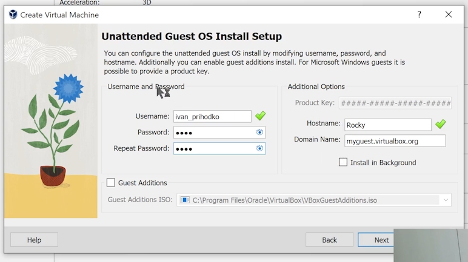
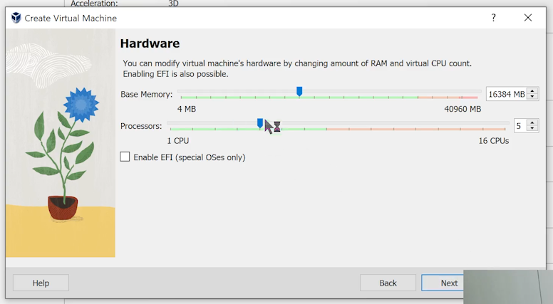
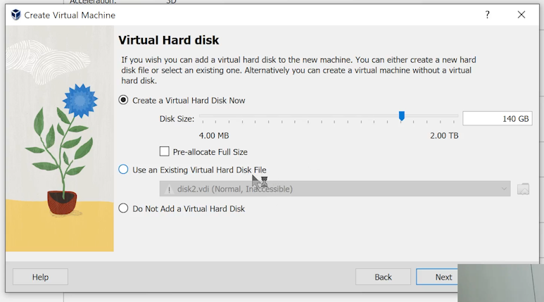
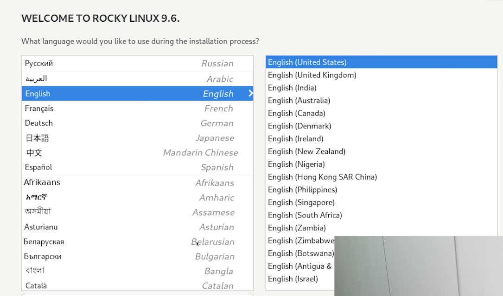
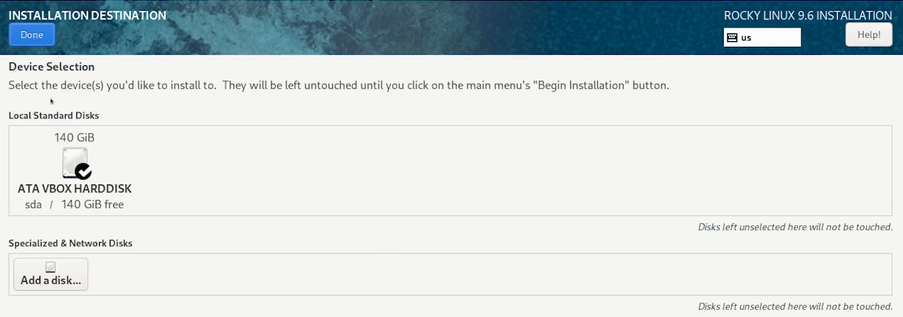
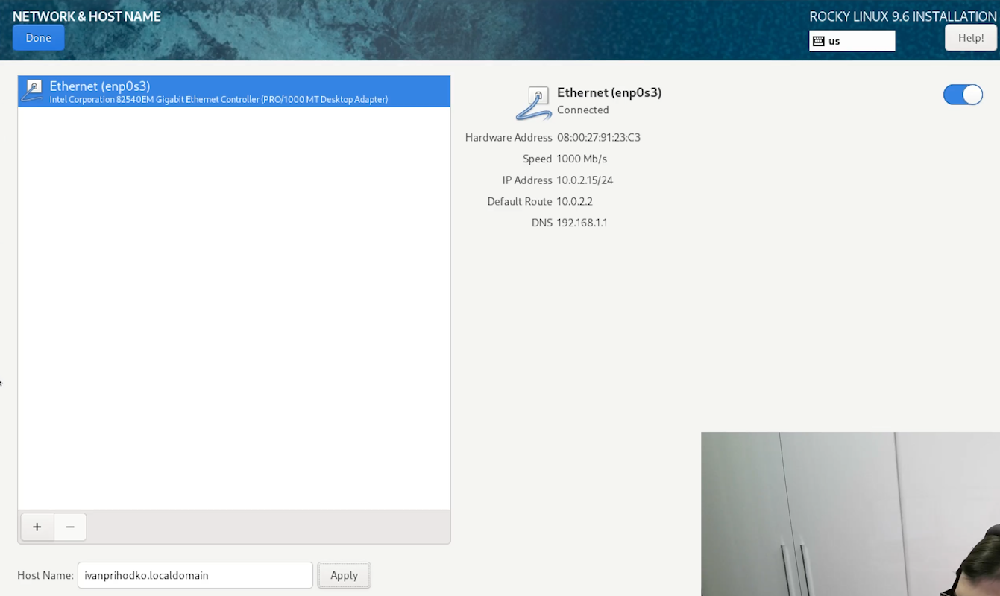
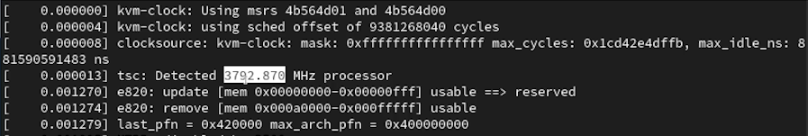
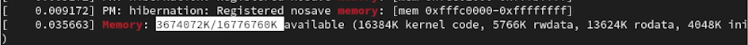

---
## Front matter
lang: ru-RU
title: Лабораторная работа
subtitle: Номер 1
author:
  - Приходько И. И. 
institute:
  - Российский университет дружбы народов, Москва, Россия
date: 4 сентября 2026

## i18n babel
babel-lang: russian
babel-otherlangs: english

## Formatting pdf
toc: false
toc-title: Содержание
slide_level: 2
aspectratio: 169
section-titles: true
theme: metropolis
header-includes:
 - \metroset{progressbar=frametitle,sectionpage=progressbar,numbering=fraction}

## Fonts
mainfont: IBM Plex Serif
romanfont: IBM Plex Serif
sansfont: IBM Plex Sans
monofont: IBM Plex Mono
mathfont: STIX Two Math
mainfontoptions: Ligatures=Common,Ligatures=TeX,Scale=0.94
romanfontoptions: Ligatures=Common,Ligatures=TeX,Scale=0.94
sansfontoptions: Ligatures=Common,Ligatures=TeX,Scale=MatchLowercase,Scale=0.94
monofontoptions: Scale=MatchLowercase,Scale=0.94,FakeStretch=0.9
mathfontoptions:
---

# Информация

## Докладчик

:::::::::::::: {.columns align=center}
::: {.column width="70%"}

  * Приходько Иван Иванович
  * Студент
  * Российский университет дружбы народов

:::
::: {.column width="30%"}

:::
::::::::::::::

## Цель работы

Приобрестение практических навыков для установки операционной системы на виртуальную машину, настройки минимально необходимых для дальнейшей работы сервисов.

## Установка Kali Linux

Для начала добавляем установочный диск

## Установка Kali Linux

Устанавливаем имя и пароль

## Установка Kali Linux

Устанавливаем процессоры и оперативную память

## Установка Kali Linux

Устанавливаем размер жесткого диска

## Установка Kali Linux

После этого уставливаем язык

## Установка Kali Linux

Устанавливаем пароль для админа

## Установка Kali Linux

Установка логина и пароля устройства

## Установка Kali Linux

Добавляем Debugging Tools

## Установка Kali Linux

Устанавливаем жесткий диск (рис. [-@fig:009]).

## Установка Kali Linux

Вписываем имя хоста (рис. [-@fig:010]).

## Установка Kali Linux

После этого ждем установку пакетов 

## Установка Kali Linux

Находим:
1. Версия ядра Linux (Linux version).
2. Частота процессора (Detected Mhz processor).
3. Модель процессора (CPU0).
4. Объем доступной оперативной памяти (Memory available).
5. Тип обнаруженного гипервизора (Hypervisor detected).
6. Тип файловой системы корневого раздела.
7. Последовательность монтирования файловых систем.

## Установка Kali Linux

## Установка Kali Linux

## Установка Kali Linux

## Установка Kali Linux

## Установка Kali Linux

## Выводы

В ходе данной лабораторной работы были получены знания для установки Rocky.
