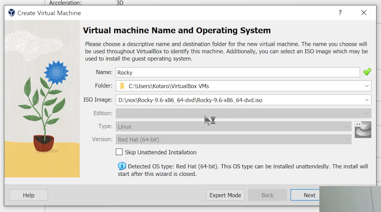
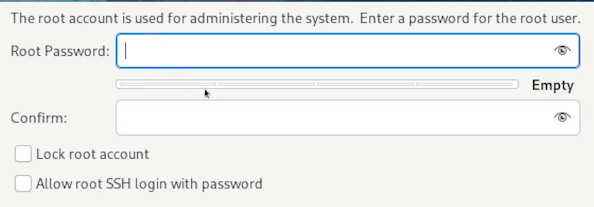
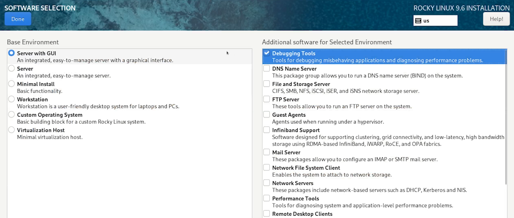
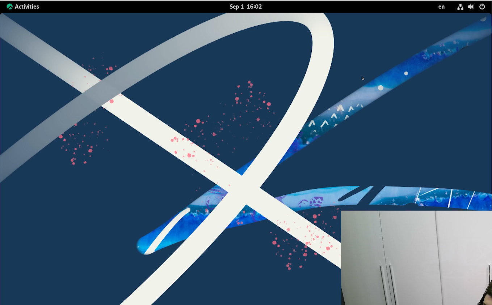
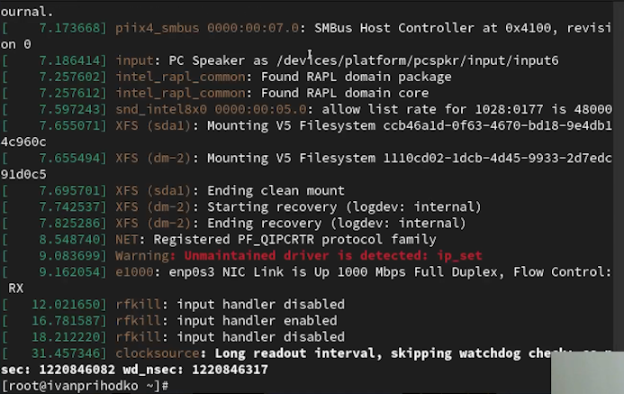
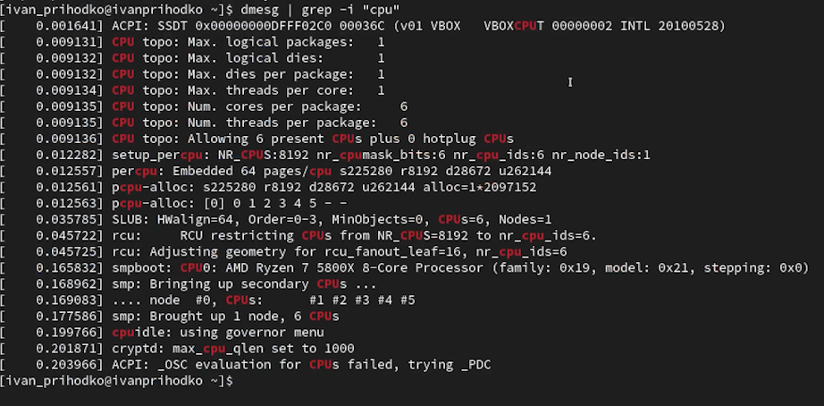
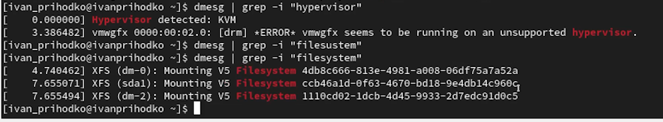

---
## Front matter
title: "Отчёт"
subtitle: "Лабораторная работа №1"
author: "Приходько Иван Иванович"

## Generic otions
lang: ru-RU
toc-title: "Содержание"

## Bibliography
bibliography: bib/cite.bib
csl: pandoc/csl/gost-r-7-0-5-2008-numeric.csl

## Pdf output format
toc: true # Table of contents
toc-depth: 2
lof: true # List of figures
lot: true # List of tables
fontsize: 12pt
linestretch: 1.5
papersize: a4
documentclass: scrreprt
## I18n polyglossia
polyglossia-lang:
  name: russian
  options:
	- spelling=modern
	- babelshorthands=true
polyglossia-otherlangs:
  name: english
## I18n babel
babel-lang: russian
babel-otherlangs: english
## Fonts
mainfont: IBM Plex Serif
romanfont: IBM Plex Serif
sansfont: IBM Plex Sans
monofont: IBM Plex Mono
mathfont: STIX Two Math
mainfontoptions: Ligatures=Common,Ligatures=TeX,Scale=0.94
romanfontoptions: Ligatures=Common,Ligatures=TeX,Scale=0.94
sansfontoptions: Ligatures=Common,Ligatures=TeX,Scale=MatchLowercase,Scale=0.94
monofontoptions: Scale=MatchLowercase,Scale=0.94,FakeStretch=0.9
mathfontoptions:
## Biblatex
biblatex: true
biblio-style: "gost-numeric"
biblatexoptions:
  - parentracker=true
  - backend=biber
  - hyperref=auto
  - language=auto
  - autolang=other*
  - citestyle=gost-numeric
## Pandoc-crossref LaTeX customization
figureTitle: "Рис."
tableTitle: "Таблица"
listingTitle: "Листинг"
lofTitle: "Список иллюстраций"
lotTitle: "Список таблиц"
lolTitle: "Листинги"
## Misc options
indent: true
header-includes:
  - \usepackage{indentfirst}
  - \usepackage{float} # keep figures where there are in the text
  - \floatplacement{figure}{H} # keep figures where there are in the text
---

# Цель работы

Приобрестение практических навыков для установки операционной системы на виртуальную машину, настройки минимально необходимых для дальнейшей работы сервисов.

# Задание

Приобрести практические навыки для установки операционной системы на виртуальную машину, настройки минимально необходимых для дальнейшей работы сервисов.

# Выполнение лабораторной работы

Для начала добавляем установочный диск (рис. [-@fig:001]).

{#fig:001 width=70%}

Устанавливаем имя и пароль (рис. [-@fig:002]).

{#fig:002 width=70%}

Устанавливаем процессоры и оперативную память (рис. [-@fig:003]).

{#fig:003 width=70%}

Устанавливаем размер жесткого диска (рис. [-@fig:004]).

{#fig:004 width=70%}

После этого уставливаем язык (рис. [-@fig:005]).

{#fig:005 width=70%}

Устанавливаем пароль для админа (рис. [-@fig:006]).

{#fig:006 width=70%}

Установка логина и пароля устройства (рис. [-@fig:007]).

{#fig:007 width=70%}

Добавляем Debugging Tools (рис. [-@fig:008]).

{#fig:008 width=70%}

Устанавливаем жесткий диск (рис. [-@fig:009]).

{#fig:009 width=70%}

Вписываем имя хоста (рис. [-@fig:010]).

{#fig:010 width=70%}

После этого ждем установку пакетов (рис. [-@fig:011]).

{#fig:011 width=70%}

Находим: (рис. [-@fig:012]-[-@fig:016]).
1. Версия ядра Linux (Linux version).
2. Частота процессора (Detected Mhz processor).
3. Модель процессора (CPU0).
4. Объем доступной оперативной памяти (Memory available).
5. Тип обнаруженного гипервизора (Hypervisor detected).
6. Тип файловой системы корневого раздела.
7. Последовательность монтирования файловых систем.

{#fig:012 width=70%}

{#fig:013 width=70%}

{#fig:014 width=70%}

{#fig:015 width=70%}

{#fig:016 width=70%}

# Выводы

В ходе данной лабораторной работы были получены знания для установки Rocky.
