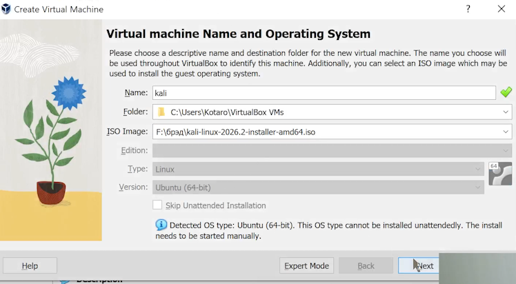
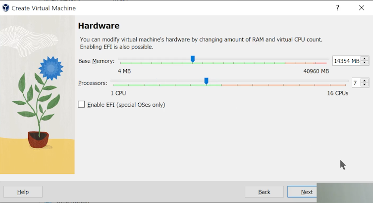
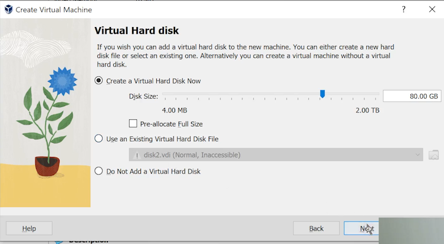
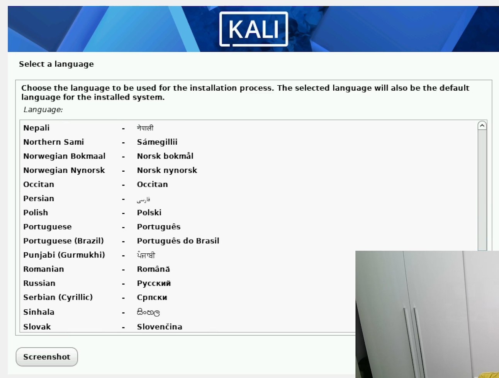
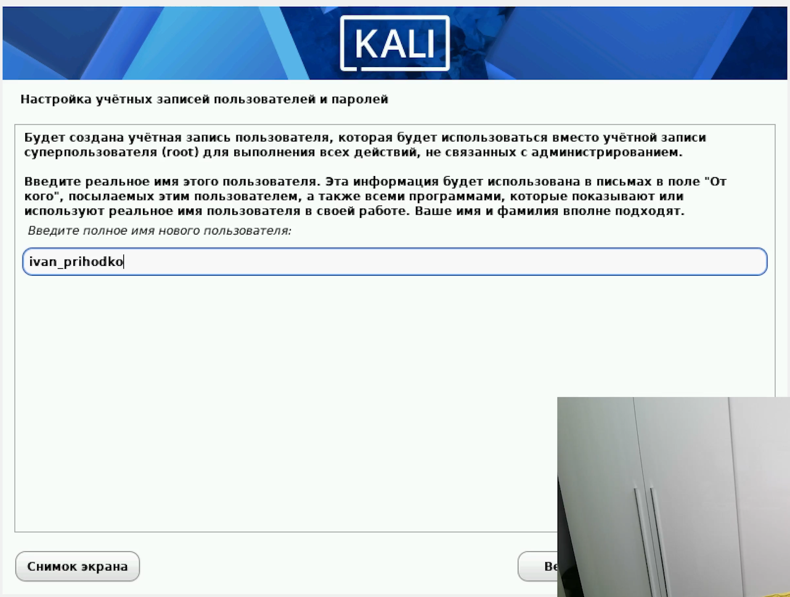
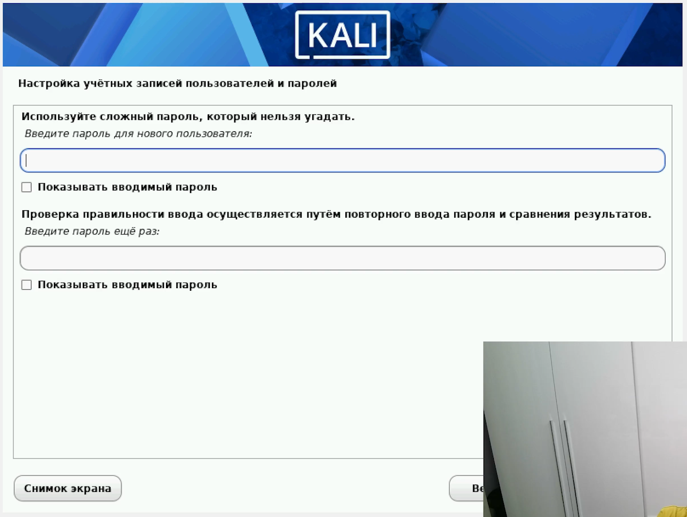
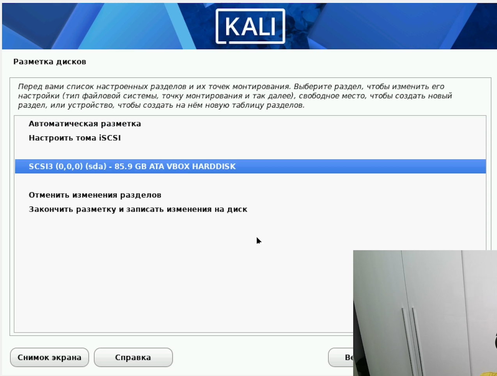
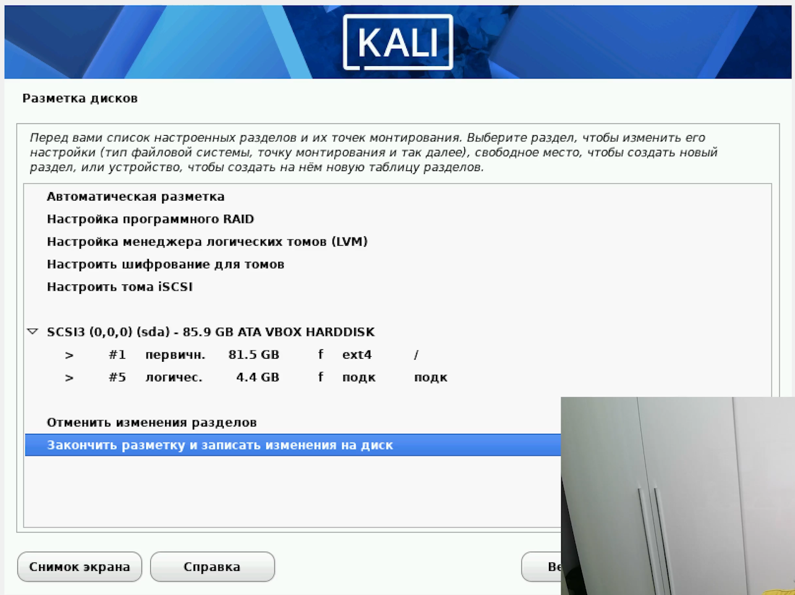
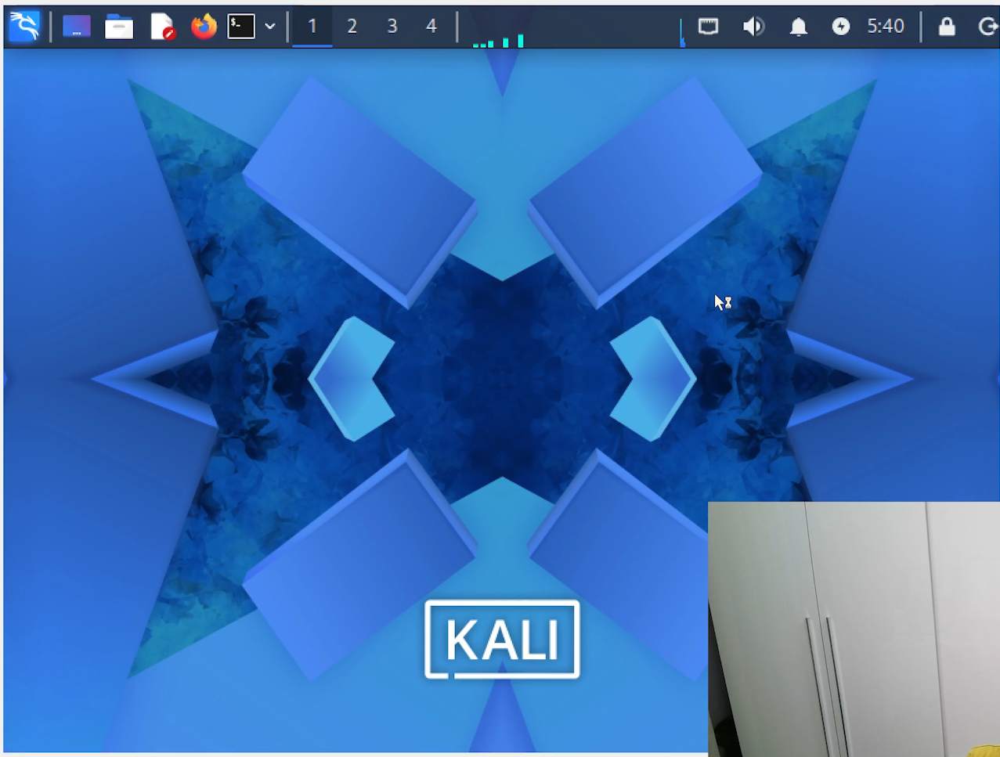

---
## Front matter
lang: ru-RU
title: Индивидуальный проект
subtitle: Номер 1
author:
  - Приходько И. И. 
institute:
  - Российский университет дружбы народов, Москва, Россия
date: 4 сентября 2026

## i18n babel
babel-lang: russian
babel-otherlangs: english

## Formatting pdf
toc: false
toc-title: Содержание
slide_level: 2
aspectratio: 169
section-titles: true
theme: metropolis
header-includes:
 - \metroset{progressbar=frametitle,sectionpage=progressbar,numbering=fraction}

## Fonts
mainfont: IBM Plex Serif
romanfont: IBM Plex Serif
sansfont: IBM Plex Sans
monofont: IBM Plex Mono
mathfont: STIX Two Math
mainfontoptions: Ligatures=Common,Ligatures=TeX,Scale=0.94
romanfontoptions: Ligatures=Common,Ligatures=TeX,Scale=0.94
sansfontoptions: Ligatures=Common,Ligatures=TeX,Scale=MatchLowercase,Scale=0.94
monofontoptions: Scale=MatchLowercase,Scale=0.94,FakeStretch=0.9
mathfontoptions:
---

# Информация

## Докладчик

:::::::::::::: {.columns align=center}
::: {.column width="70%"}

  * Приходько Иван Иванович
  * Студент
  * Российский университет дружбы народов

:::
::: {.column width="30%"}

:::
::::::::::::::

## Цель работы

Установить и настроить kali linux.

## Установка kali linux

Устанавливаем имя и добавляем установочный диск

## Установка kali linux

Устанавливаем оперативную память и процессоры

## Установка kali linux

Устанавливаем размер жесткого диска 

## Установка kali linux

Устанавливаем язык

## Установка kali linux

Устанавливаем имя пользователя 

## Установка kali linux

Устанавливаем пароль 

## Установка kali linux

Размечаем диски

## Установка kali linux

Размечаем диски 

## Установка kali linux

Успешно запускаем машину

## Выводы

В ходе данного этапа были получены знания для установки и настройки kali linux.
