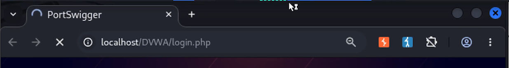
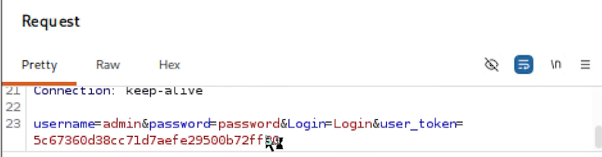
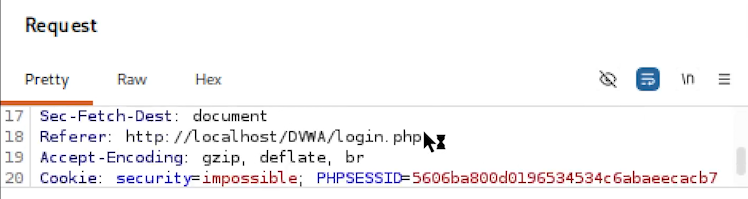

---
## Front matter
lang: ru-RU
title: Индивидуальный проект
subtitle: Номер 5
author:
  - Приходько И. И. 
institute:
  - Российский университет дружбы народов, Москва, Россия
date: 4 сентября 2026

## i18n babel
babel-lang: russian
babel-otherlangs: english

## Formatting pdf
toc: false
toc-title: Содержание
slide_level: 2
aspectratio: 169
section-titles: true
theme: metropolis
header-includes:
 - \metroset{progressbar=frametitle,sectionpage=progressbar,numbering=fraction}

## Fonts
mainfont: IBM Plex Serif
romanfont: IBM Plex Serif
sansfont: IBM Plex Sans
monofont: IBM Plex Mono
mathfont: STIX Two Math
mainfontoptions: Ligatures=Common,Ligatures=TeX,Scale=0.94
romanfontoptions: Ligatures=Common,Ligatures=TeX,Scale=0.94
sansfontoptions: Ligatures=Common,Ligatures=TeX,Scale=MatchLowercase,Scale=0.94
monofontoptions: Scale=MatchLowercase,Scale=0.94,FakeStretch=0.9
mathfontoptions:
---

# Информация

## Докладчик

:::::::::::::: {.columns align=center}
::: {.column width="70%"}

  * Приходько Иван Иванович
  * Студент
  * Российский университет дружбы народов

:::
::: {.column width="30%"}

:::
::::::::::::::

## Цель работы

Работа с Burp Suite.

## Работа с Burp Suite

Запускаем Burp Suite 

## Работа с Burp Suite

Включаем соединение

## Работа с Burp Suite

Вводим локальный сервер

## Работа с Burp Suite

Видим сайт в подлючении

## Работа с Burp Suite

После залогинивания можем увидеть всю информацию о нашем заходе на сайт

## Работа с Burp Suite

## Выводы

В ходе данного этапа были получены знания для работы с Burp Suite.
